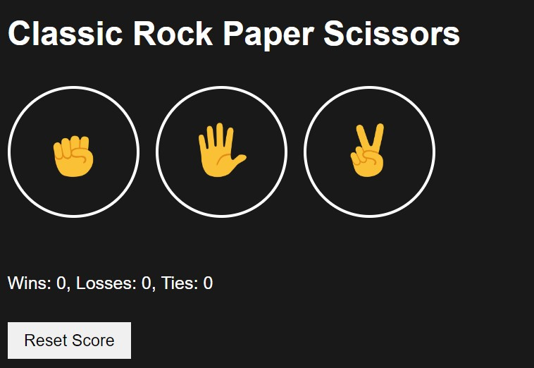
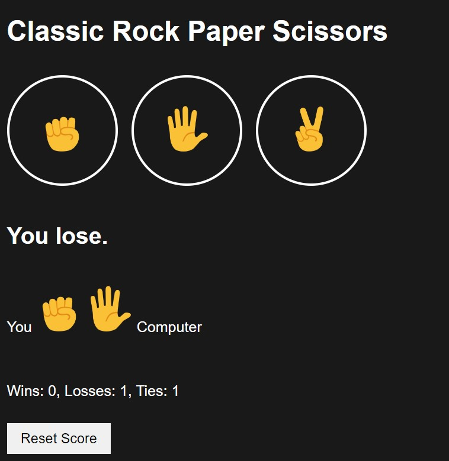
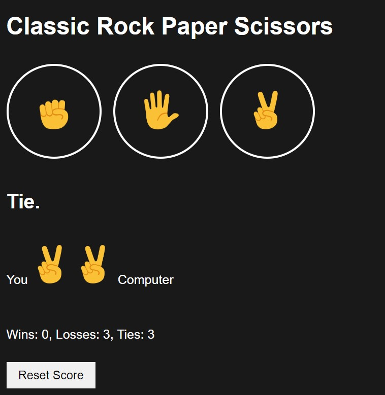
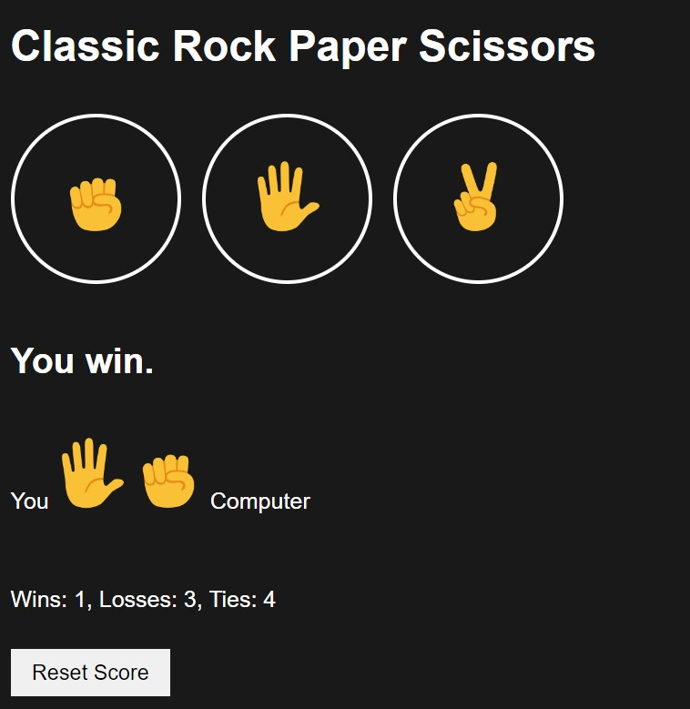
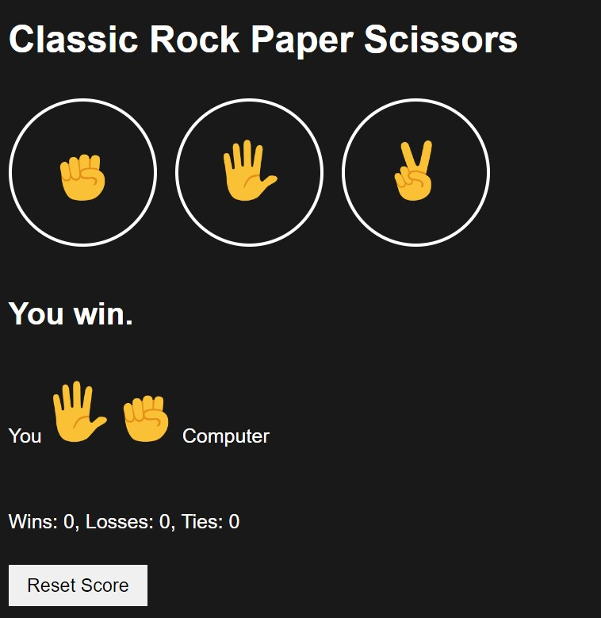

# Project: Classic Rock-Paper-Scissors game #

This project implemented using HTML, CSS, and JavaScript.  

*The HTML file contains elements for:*
- *displaying the game's title,*
- *buttons for the player to choose their move (rock, paper, or scissors),* 
- *a section to display the game result and moves, and*
- *a score section.*  
---

*The CSS file styles:*
- *the background,*
- *text, buttons, and
- other elements for a visually appealing layout.*
---

*The JavaScript code handles the game logic:*
- *including generating a random move for the computer*,
- *determining the winner or if it's a tie,*
- *updating the score, and*
- *displaying the result and moves on the webpage.*

*It also includes a function to reset the score when the corresponding button is clicked.  
The game uses localStorage to store and retrieve the player's score across sessions, ensuring continuity between game plays.*

*Overall, it's a simple and interactive implementation of the classic Rock Paper Scissors game for web browsers.*

## Project Screenshots ##

Project Start Overview  

*These screenshots present the project's initial state:*
- *featuring suggested game moves (rock, paper, scissors) and*
- *reset statistics, along with a button to restore default settings.*

---

Gameplay Snapshots

*This screenshot captures an active game session:*
- *displaying the match result,*
- *the moves made by both the user and the computer,*
- *updated statistics, and the presence of a reset button for managing game states.*

---

Reset State Display

*This screenshot showcases the aftermath of resetting game statistics.  
It includes the list of moves, the previous game result, previous moves made, and updated statistics.  
Additionally, a reset button is prominently displayed to facilitate further game resets or modifications.*

